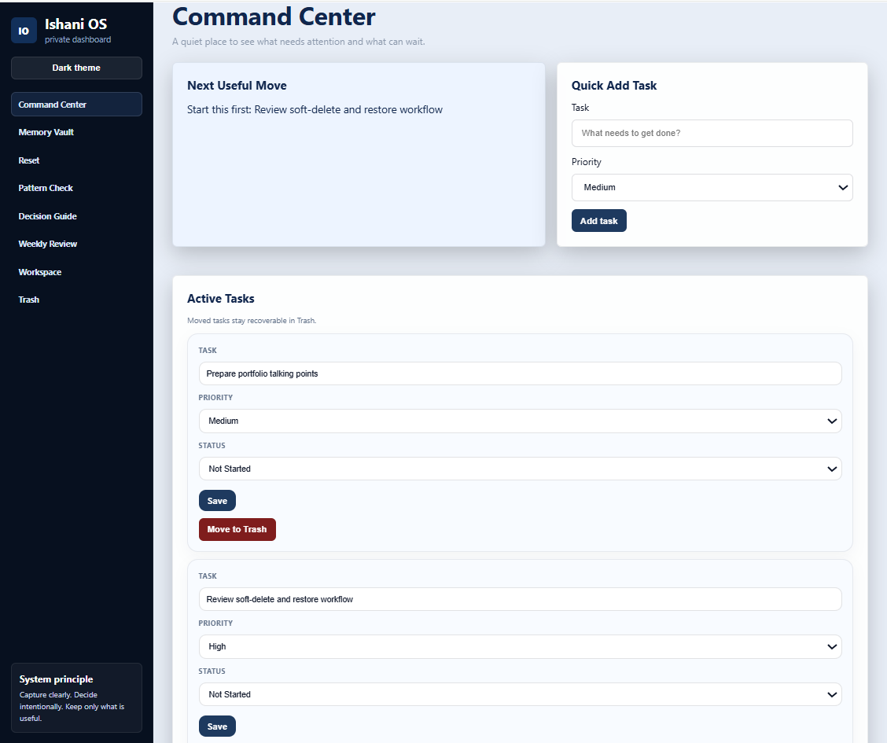
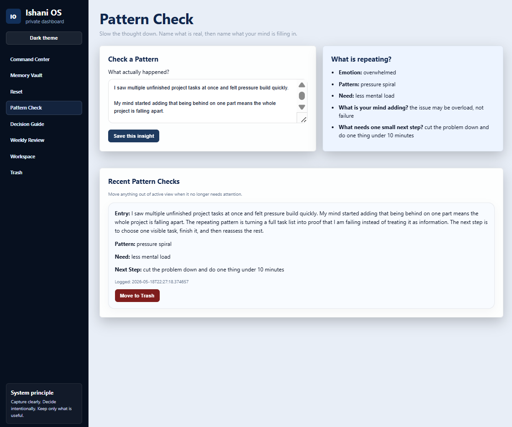
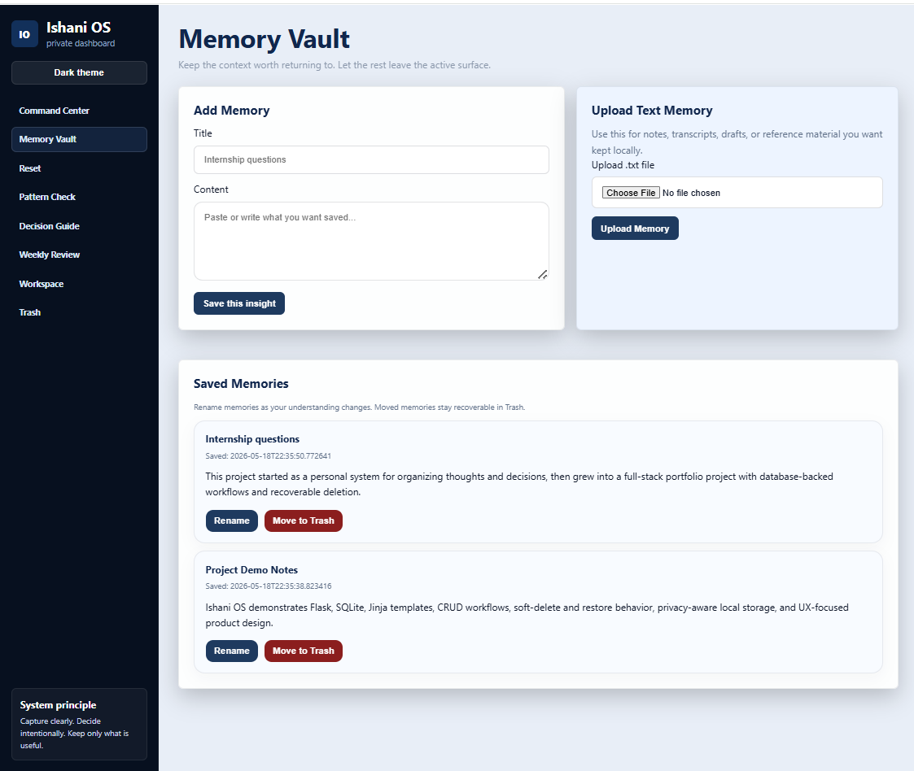
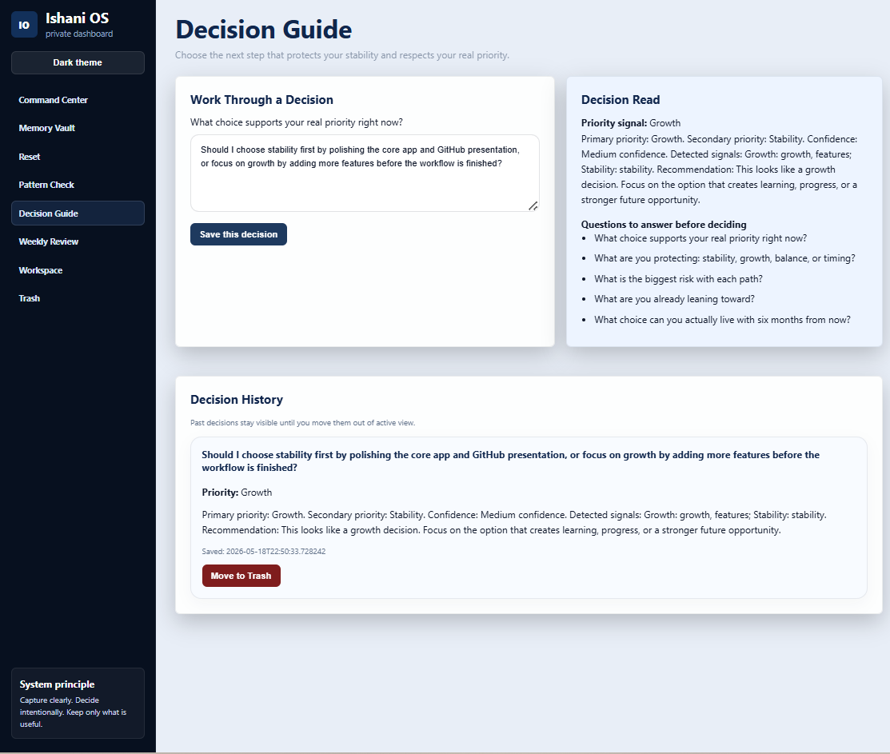
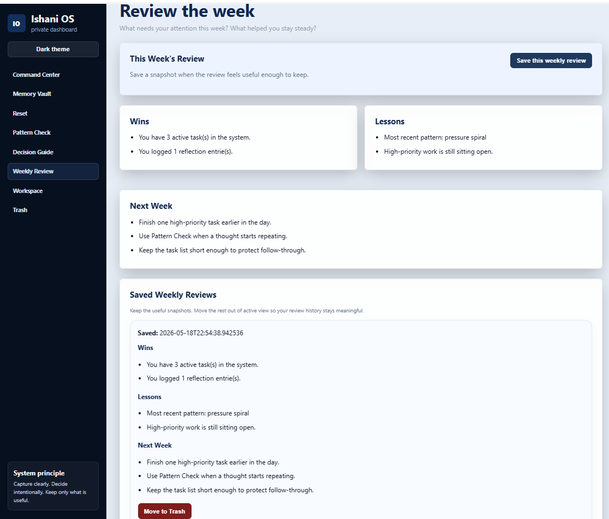
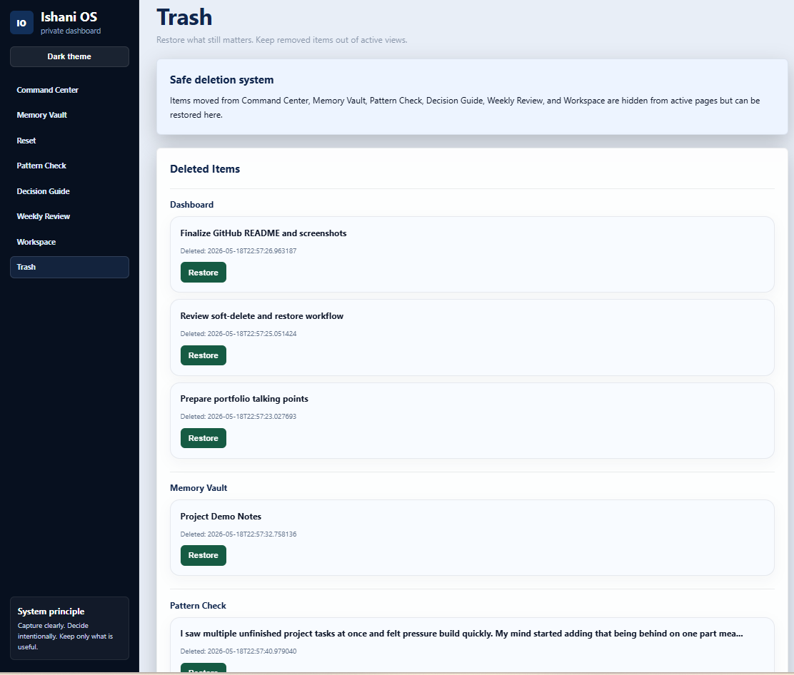

# Ishani OS

Ishani OS is a local-first Flask and SQLite app for tracking tasks, decisions, patterns, memories, weekly reviews, and personal workflows in one place.

## Product Overview

Ishani OS gives me one local workspace for information that would normally be split across notes, task lists, reminders, and conversations.

The app is built with Flask, SQLite, Jinja templates, HTML, CSS, and JavaScript. It runs locally and stores data on the user's machine.

This project is not meant to be a generic journal app or a chatbot. I built it as a structured Flask project with real database-backed workflows, saved history, and recoverable deleted records.

## Why I Built It

I built Ishani OS because I wanted a private system for tracking what needs attention, saving useful context, working through decisions, and reviewing the week without depending on a cloud-based tool.

I also wanted to practice full-stack development through a project that behaves like a real app: multiple routes, persistent data, editable records, soft delete, restore behavior, and a clear interface.

## Current Features

### Dashboard

The Dashboard shows active tasks and the next useful move. Tasks can be added, edited, updated by priority and status, and moved to Trash.

### Pattern Check

Pattern Check saves reflection entries that break down a thought or situation into a pattern, need, reality check, and next step. Deleted reflections can be restored from Trash.

### Memory Vault

Memory Vault stores notes, project context, reminders, and reference material. Saved memories can be renamed, moved to Trash, and restored.

### Decision Guide

Decision Guide helps work through a decision by identifying whether the decision is mainly about stability, growth, balance, or timing. Decision history is saved so past decisions can be reviewed later.

### Weekly Review

Weekly Review pulls together wins, lessons, and next steps for the week. Reviews can be saved and moved to Trash when they are no longer needed.

### Reset Mode

Reset Mode is a simple page for slowing down and choosing the next step when things feel scattered.

### Trash and Restore

Ishani OS uses soft delete behavior instead of permanently removing records right away. Deleted tasks, memories, reflections, decisions, reviews, folders, and workspace threads can be restored from Trash.

## Tech Stack

- Python
- Flask
- SQLite
- Jinja templates
- HTML
- CSS
- JavaScript
- Optional local Ollama integration

## Screenshots

### Dashboard


### Pattern Check


### Memory Vault


### Decision Guide


### Weekly Review


### Trash and Restore


## Demo Flow

A simple demo flow for the app:

1. Add a few tasks on the Dashboard.
2. Save a Pattern Check entry using safe sample text.
3. Add a Memory Vault note.
4. Work through a decision in Decision Guide.
5. Save a Weekly Review.
6. Move one or two records to Trash.
7. Restore them from the Trash page.

This flow shows the main CRUD behavior, saved history, and soft-delete system.

## Installation

Clone the repository:

```powershell
git clone https://github.com/arni1596/ishani-os.git
cd ishani-os
```

Create and activate a virtual environment:

```powershell
python -m venv venv
.\venv\Scripts\activate
```

Install dependencies:

```powershell
pip install -r requirements.txt
```

Run the app:

```powershell
python app.py
```

Open the app in your browser:

```text
http://127.0.0.1:5000
```

## Project Structure

```text
ishani-os/
|-- app.py
|-- requirements.txt
|-- README.md
|-- LICENSE
|-- templates/
|   |-- base.html
|   |-- dashboard.html
|   |-- memory.html
|   |-- pattern.html
|   |-- decision.html
|   |-- review.html
|   |-- reset.html
|   |-- chat.html
|   `-- trash.html
|-- static/
|   |-- style.css
|   `-- script.js
`-- assets/
    `-- screenshots/
```

## Database and Privacy Note

Ishani OS uses SQLite to store data locally on your machine. When the app runs, it creates a local database file for tasks, memories, reflections, decisions, reviews, and deleted items.

Because the app can contain personal notes and uploaded files, local data files should not be committed to GitHub. The `.gitignore` excludes files such as:

- database.db
- uploads/
- .env
- venv/
- __pycache__/

The app also includes optional local Ollama support for workspace responses. If used, Ollama runs on the user's machine through `http://localhost:11434`. This is optional and is not required for the main dashboard, memory, decision, review, or trash workflows.

## What I Learned

This project helped me practice building a small but complete Flask application with database-backed workflows.

I worked on:

- Designing routes for multiple connected features.
- Creating reusable Jinja templates.
- Storing and updating records with SQLite.
- Adding soft-delete and restore behavior with `deleted_at` timestamps.
- Improving UI wording so the app feels clear instead of cluttered.
- Preparing a project for GitHub with screenshots, a README, a license, and a clean `.gitignore`.

## Future Improvements

Future improvements I would like to add:

- Better folder organization for saved memories and workspace threads.
- Search and filtering across saved entries.
- A cleaner empty-state design for each page.
- More detailed weekly review trends over time.
- Optional local model support through Ollama.
- Export options for saved reviews or memories.
- More automated tests for routes and database behavior.

## Technical Highlights

- Built a Flask and SQLite application with database-backed workflows for tasks, memories, reflections, decisions, and weekly reviews.
- Added soft-delete and restore behavior with `deleted_at` timestamps so records can be recovered instead of permanently removed right away.
- Used Jinja templates to keep the interface modular across the main feature areas.
- Designed a local-first structure where the database and uploaded files stay on the user's machine and are excluded from GitHub.
- Organized the app around clear feature areas: Dashboard, Pattern Check, Memory Vault, Decision Guide, Weekly Review, Reset Mode, and Trash.

## License

This project is licensed under the MIT License.
